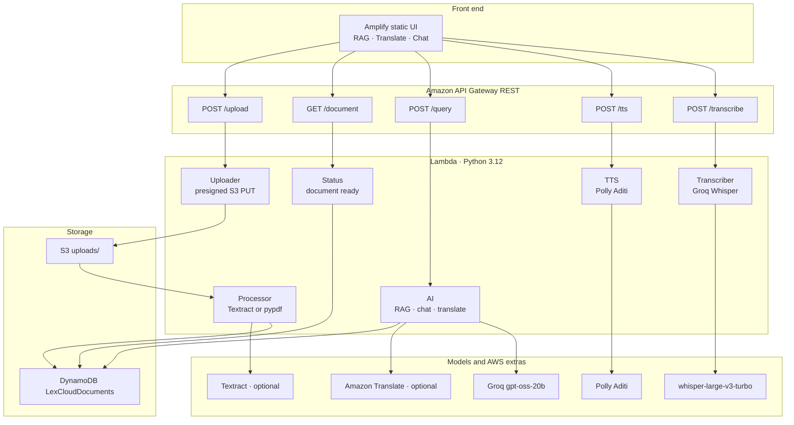
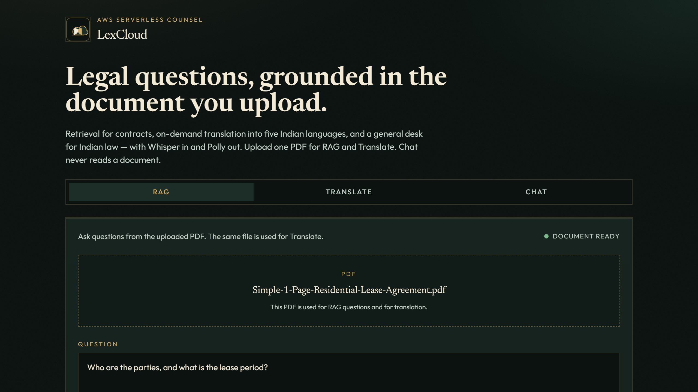
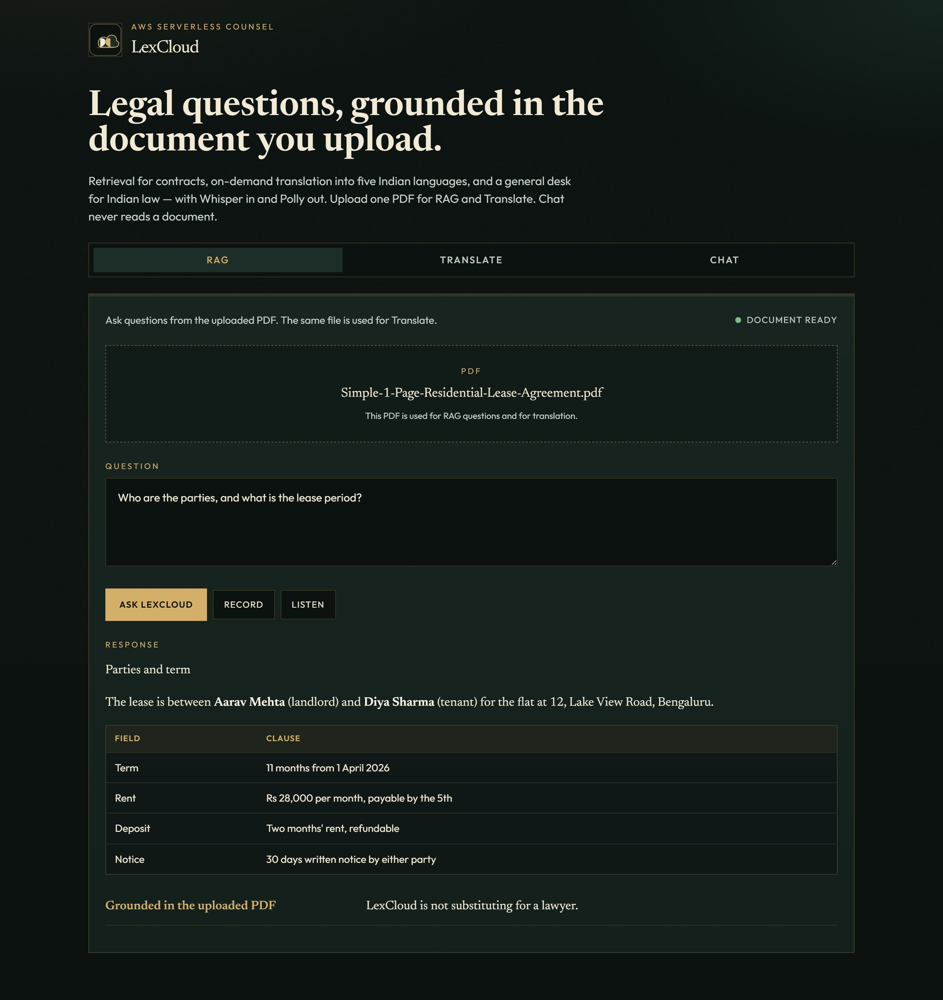
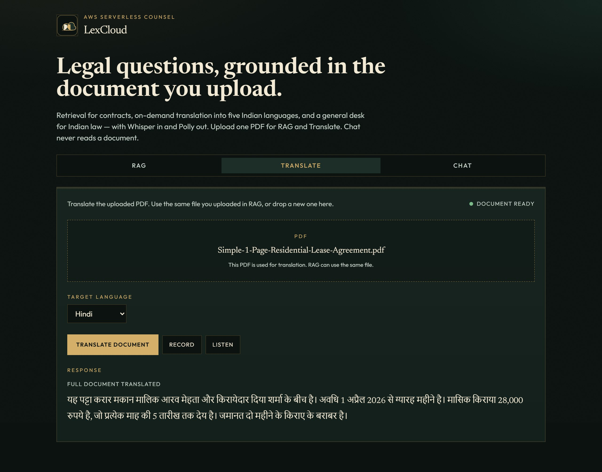
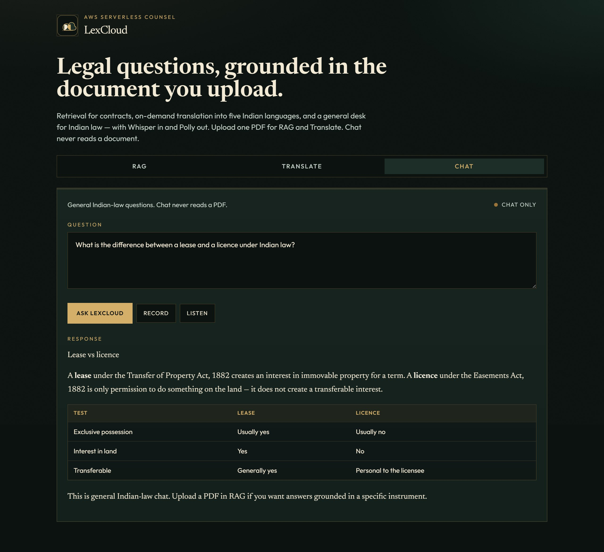
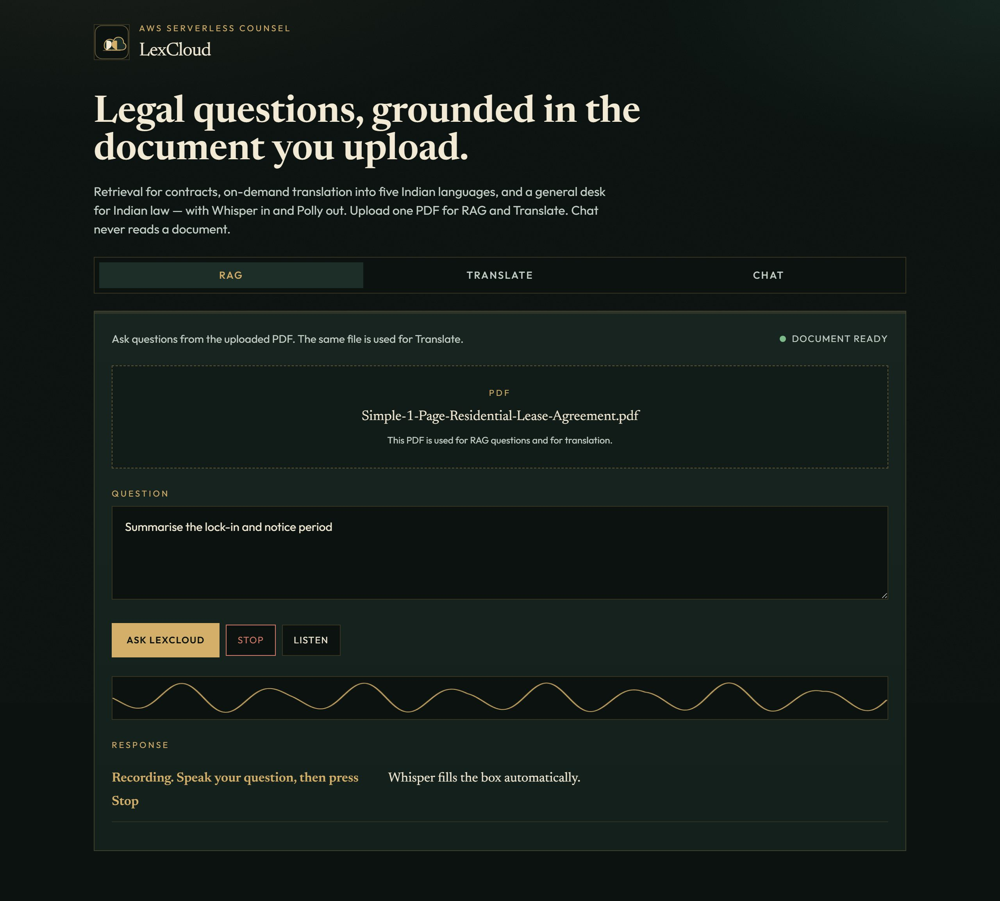
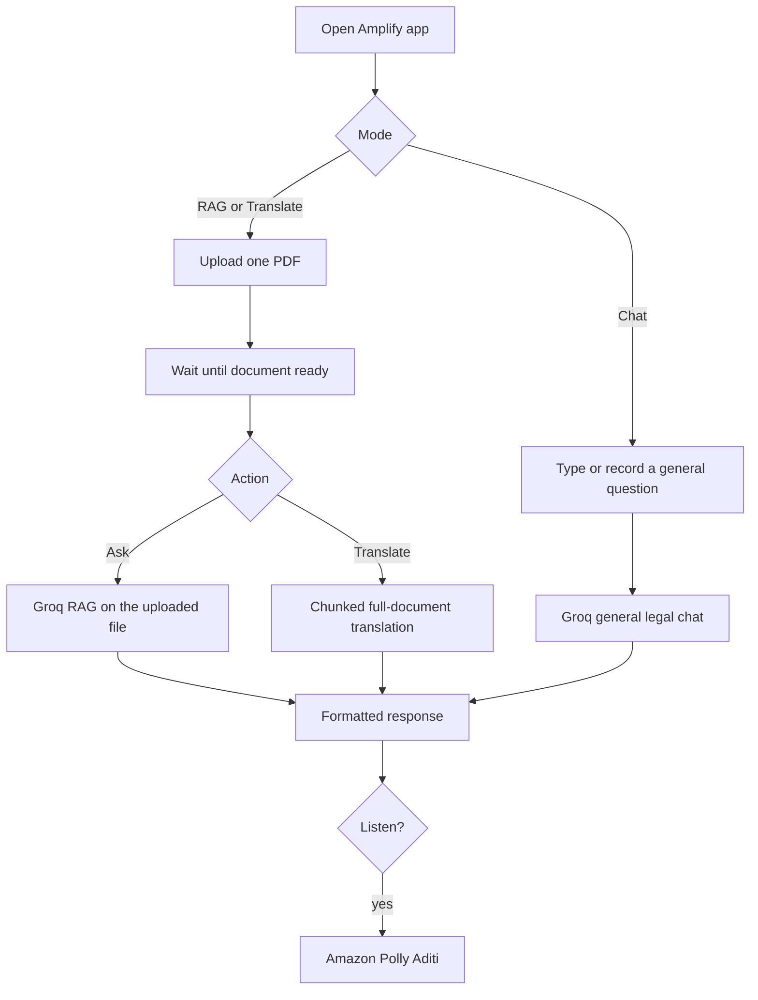

<!-- Upper section: hero -->
<div align="center">

</div>

---

<div align="center">


<p><b>LexCloud</b></p>

<p>AI-Powered Legal Advisor for Indian Law</p>

A serverless counsel that **uploads legal PDFs**, **answers from the document (RAG)**, **translates into Indian languages**, and supports **voice in (Whisper)** and **voice out (Amazon Polly)** — hosted on AWS Amplify.

[](https://aws.amazon.com/)
[](https://aws.amazon.com/lambda/)
[](https://aws.amazon.com/api-gateway/)
[](https://aws.amazon.com/s3/)
[](https://aws.amazon.com/dynamodb/)
[](https://aws.amazon.com/amplify/)
[](https://groq.com/)
[](https://aws.amazon.com/polly/)
[](LICENSE)

**Theme** · Ink (`#0b1210`) · Brass (`#d4af6a`) · Parchment (`#f3ead6`) · Editorial legal UI

[Live app](https://main.d2pw2pic3w5m1.amplifyapp.com) · API `https://pvkvjvq3pj.execute-api.ap-south-1.amazonaws.com/prod`

**Built by [Mohammed Rashique Shuraim](https://github.com/MohammedShuraim)**

</div>

---

<div align="center">

### See it with your own eyes

▶️ **[Watch the LexCloud demo on Loom](https://www.loom.com/share/ed575fdabd3142d5bef7168b4414385a)**

Upload a legal PDF · Ask with RAG · Translate the full document · Record a question · Hear Polly read the answer

GitHub cannot play video inside a README — click the link to watch the walkthrough.

</div>

---

## Project Overview

**LexCloud** is a cloud-native legal desk for Indian contracts and statutes. Upload a PDF once, then **ask (RAG)** or **translate** it. **Chat** never reads a document.

The product is one counsel — not a pile of Lambdas taped together. Presigned upload, extract, retrieve, translate, Whisper, and Polly all share the same document record.

| Capability | What it does |
|---|---|
| **RAG** | Upload a PDF, extract text, retrieve relevant passages, ask grounded questions |
| **Translate** | Full-document translation to Hindi, Tamil, Telugu, Malayalam, Kannada |
| **Chat** | General Indian-law questions with no PDF lookup |
| **Voice in** | Record → Stop → Groq Whisper fills the question box |
| **Voice out** | Amazon Polly (Aditi) reads the last answer |
| **Hosting** | Static UI on AWS Amplify, API on API Gateway + Lambda |

The product journey is designed as one loop:

**Upload or speak → Extract or transcribe → Retrieve / translate / chat → Format the opinion → Optional Polly playback.**

---

## Architecture



**Upload path**

`Dropzone → POST /upload → presigned S3 PUT → Processor (Textract or pypdf) → DynamoDB → GET /document until ready`

**Question path**

`Ask LexCloud → POST /query → RAG chunks + Groq, or Translate chunks, or general chat → formatted markdown in the UI`

**Voice path**

`Record → Stop → POST /transcribe (Whisper) → textarea → Ask → POST /tts (Polly MP3)`

pypdf and Groq cover extract and translate when Textract or Amazon Translate are not subscribed on the account.

---

## UI Showcase

> Visual language: ink (`#0b1210`), brass (`#d4af6a`), parchment (`#f3ead6`), Newsreader headings, Outfit UI, dashed dropzone, live waveform.

| Surface | Preview |
|---|---|
| **Live Amplify desk** |  |
| **RAG** |  |
| **Translate** |  |
| **Chat** |  |
| **Voice recorder** |  |

Open the [live app](https://main.d2pw2pic3w5m1.amplifyapp.com) to click through the same surfaces.

---

## Application Flow



On the web UI, **Stop** is the intent for voice — Whisper fills the box as soon as you stop. After you ask:

**Retrieving → Drafting → Reveal the opinion → Optional Listen**

---

## Features

### Modes

| Feature | Status |
|---|---|
| One PDF shared by RAG and Translate | Implemented |
| Chat never reads a PDF | Implemented |
| Per-mode document status pill | Implemented |
| Markdown tables, headings, bullets | Implemented |
| Section-by-section answer reveal | Implemented |

### Documents

| Feature | Status |
|---|---|
| Presigned S3 PUT (regional host) | Implemented |
| Async Textract when subscribed | Implemented |
| pypdf fallback if Textract is not subscribed | Implemented |
| Document-ready polling | Implemented |
| Chunked full-document translation | Implemented |
| Groq translate fallback if Amazon Translate is not subscribed | Implemented |

### Voice

| Feature | Status |
|---|---|
| Record starts capture | Implemented |
| Stop transcribes immediately | Implemented |
| Groq `whisper-large-v3-turbo` | Implemented |
| Polly Aditi MP3 | Implemented |
| Cloudflare-safe User-Agent on Groq | Implemented |
| Groq 429 retries | Implemented |

---

## Technology Stack

| Layer | Technologies |
|---|---|
| **Frontend** | HTML · Tailwind CDN · vanilla JS · MediaRecorder · WebAudio |
| **Hosting** | AWS Amplify (`amplify.yml` injects `LEXCLOUD_API_BASE_URL`) |
| **API** | Amazon API Gateway REST · `/upload` `/document` `/query` `/tts` `/transcribe` |
| **Compute** | AWS Lambda · Python 3.12 |
| **Storage** | S3 `lexcloud-uploads-{account}` · DynamoDB `LexCloudDocuments` |
| **AI** | Groq `openai/gpt-oss-20b` · Whisper Large v3 Turbo |
| **AWS extras** | Textract · Translate · Polly Aditi · CloudWatch · IAM |
| **IaC** | `template.yaml` (SAM transform) deployed with AWS CLI |

---

## Setup Instructions

### Prerequisites

- AWS CLI signed in (this stack uses `ap-south-1`)
- A Groq key from [console.groq.com/keys](https://console.groq.com/keys)
- Node is **not** required — the UI is static
- Chrome for local microphone tests *(or use the Amplify HTTPS URL)*

### 1. Clone

```bash
git clone https://github.com/MohammedShuraim/LexCloud.git
cd LexCloud
```

### 2. Local frontend

```bash
copy frontend\js\config.example.js frontend\js\config.js
```

Set `apiBaseUrl` to the deployed API (or your own stack output `ApiBaseUrl`). Open `frontend/index.html` in Chrome.

| Surface | URL |
|---|---|
| Live Amplify app | https://main.d2pw2pic3w5m1.amplifyapp.com |
| API base | `https://pvkvjvq3pj.execute-api.ap-south-1.amazonaws.com/prod` |
| Product video | [Loom walkthrough](https://www.loom.com/share/ed575fdabd3142d5bef7168b4414385a) |

### 3. Deploy infrastructure

```bash
aws cloudformation package --template-file template.yaml --s3-bucket YOUR_ARTIFACT_BUCKET --output-template-file packaged.yaml --region ap-south-1

aws cloudformation deploy --template-file packaged.yaml --stack-name lexcloud --capabilities CAPABILITY_IAM CAPABILITY_NAMED_IAM CAPABILITY_AUTO_EXPAND --parameter-overrides GroqApiKey=YOUR_KEY --region ap-south-1
```

After first create, attach the S3 → processor trigger (same-stack S3 events circular-depend on the API):

```bash
aws lambda add-permission --function-name LexCloudProcessor --principal s3.amazonaws.com --statement-id AllowLexCloudS3Invoke --action lambda:InvokeFunction --source-arn arn:aws:s3:::lexcloud-uploads-ACCOUNT --source-account ACCOUNT --region ap-south-1
```

Then `put-bucket-notification-configuration` on prefix `uploads/`.

### 4. Amplify

`amplify.yml` writes `frontend/js/config.js` from `LEXCLOUD_API_BASE_URL`. Connect GitHub `main` and set that env var to `ApiBaseUrl`.

> **Never commit Groq keys or `frontend/js/config.js`.** Rotate a leaked key in the Groq console.

---

## Project Structure

```text
LexCloud/
├── frontend/
│   ├── index.html             # RAG · Translate · Chat shell
│   ├── logo.svg               # Brand mark
│   ├── css/styles.css         # Ink / brass theme
│   └── js/
│       ├── app.js             # Modes · upload · record/stop transcribe
│       ├── api.js             # Gateway client · 429 retry
│       ├── format.js          # Markdown tables · headings · reveal
│       ├── recorder.js        # MediaRecorder + waveform
│       └── config.example.js  # apiBaseUrl template
├── lambdas/
│   ├── uploader/              # Presigned S3 PUT
│   ├── processor/             # Textract + pypdf fallback
│   ├── status/                # GET /document
│   ├── ai/                    # RAG · chat · chunked translate
│   ├── tts/                   # Polly Aditi
│   └── transcriber/           # Groq Whisper
├── docs/
│   ├── banner.jpg             # Lady Justice README hero
│   ├── logo.png               # Brand mark
│   └── screenshots/           # Product captures for this README
├── scripts/
│   └── capture_readme_shots.py
├── template.yaml              # SAM / CloudFormation
├── amplify.yml
├── LICENSE
└── README.md
```

---

## Environment Variables

The Groq key is a CloudFormation parameter (`GroqApiKey`, `NoEcho`). The browser only needs the API base URL.

### Amplify

| Variable | Description |
|---|---|
| `LEXCLOUD_API_BASE_URL` | Stack output `ApiBaseUrl` — written into `frontend/js/config.js` at build time |

### Local frontend

Template: [`frontend/js/config.example.js`](frontend/js/config.example.js) · real values go in **`frontend/js/config.js`** (gitignored).

| Key | Description |
|---|---|
| `apiBaseUrl` | Deployed API Gateway `/prod` URL |

### Lambda (set by the stack)

| Variable | Description |
|---|---|
| `GROQ_API_KEY` | From `GroqApiKey` — chat, Groq translate fallback, Whisper |
| `GROQ_MODEL` | `openai/gpt-oss-20b` |
| `DYNAMODB_TABLE_NAME` | `LexCloudDocuments` |
| `DOCUMENT_BUCKET` | Uploads bucket |

> **Never commit real keys.** If a key lands in git, rotate it in the Groq console — deleting the file is not enough.

---

## API Surface

Built for the Amplify client. Binary media types are enabled for Whisper uploads. API Gateway still caps bodies at **10 MB**.

| Method | Path | Role |
|---|---|---|
| `POST` | `/upload` | `{ fileName, fileType }` → presigned URL + `document_name` |
| `GET` | `/document` | `?document_name=` → `{ ready, status, charCount }` |
| `POST` | `/query` | RAG / chat / `FETCH_FULL_TRANSLATION` + `offset` |
| `POST` | `/tts` | `{ text }` → `{ audioBase64 }` |
| `POST` | `/transcribe` | multipart `file` → `{ transcription }` |

CORS is open for the Amplify origin.

---

## Troubleshooting

| Symptom | Fix |
|---|---|
| Groq 429 | Free-tier rate limit — wait; Lambda and the UI retry automatically |
| Groq 403 / Cloudflare 1010 | User-Agent must be set (already in the Lambdas) |
| S3 PUT 307 / 403 | Presign must use the regional virtual host (already in uploader) |
| Translate stops early | UI walks `offset` until `done` — hard-refresh if you still see the old client |
| Textract `SubscriptionRequired` | Processor falls back to pypdf; enable Textract in the console for native OCR |
| Chat answers “this document” | Chat has no PDF — switch to **RAG** and upload there |
| Microphone blocked | Chrome needs HTTPS (Amplify) or localhost |

---

## Future Enhancements

| Idea | Direction |
|---|---|
| **True vector RAG** | Embeddings + OpenSearch / Pinecone instead of lexical chunks |
| **Native Textract / Translate** | Subscribe the account so fallbacks are unused |
| **Streaming opinions** | Token stream instead of block reveal |
| **Auth** | Cognito so uploads are per user |

---

## Author

**LexCloud** is designed and built by **[Mohammed Rashique Shuraim](https://github.com/MohammedShuraim)** — a serverless Indian-law desk on AWS with Groq for reasoning and Whisper.

| | |
|---|---|
| GitHub | [@MohammedShuraim](https://github.com/MohammedShuraim) |
| This repo | [LexCloud](https://github.com/MohammedShuraim/LexCloud) |
| Live app | [Amplify](https://main.d2pw2pic3w5m1.amplifyapp.com) |
| Related work | [Sarah](https://github.com/MohammedShuraim/sarah-voice-assistant) — virtual desktop assistant |

---

## License

Distributed under the **MIT License**. See [`LICENSE`](LICENSE) for details.

---

<div align="center">

**LexCloud** — upload a brief, ask in English or voice, hear the answer read back.

Ink · Brass · Parchment · Built as one serverless counsel, not a pile of scripts.

</div>
